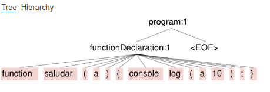
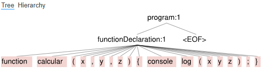
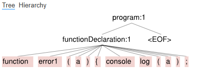
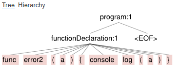

Analizador Sintáctico de Funciones - ANTLR4

Este proyecto consiste en un analizador sintáctico desarrollado con ANTLR4 y Node.js, que reconoce declaraciones de funciones sencillas y operaciones matemáticas básicas dentro de ellas.

_Estructura del Proyecto:
- `Calculator.g4`: Gramática del analizador (Lexer y Parser).
- `index.js`: Punto de entrada de la aplicación.
- `generated/`: Código fuente generado por ANTLR4 para JavaScript.
- `CustomCalculatorVisitor.js`: Lógica personalizada para recorrer el árbol.
- `archivos .txt`: Casos de prueba para validación.

 
_Requisitos e Instalación
1. Tener instalado [Node.js](https://nodejs.org/).
2. Clonar este repositorio y entrar a la carpeta:
   ```bash
   cd ssl-antlr-calculator!
3. Instalar la librería de ANTLR4 para JavaScript: 
   Bash
   npm install

_Cómo ejecutar el analizador
ejecuta:
  Bash
  node index.js

_Casos de Prueba
El repositorio incluye 4 archivos de prueba para verificar el comportamiento:
 1. Reconocimiento Correcto
       correcto1.txt: Definición estándar de una función con console.log.
       correcto2.txt: Función con múltiples parámetros y operaciones matemáticas.

 2. Reconocimiento Incorrecto (Generan Error)
       incorrecto1.txt: Falta de llave de cierre } para verificar error de estructura.incorrecto2.txt: Uso de palabras clave erróneas (func en lugar de function).

*Como acotación, no logré ejecutar el árbol en VisualStudio, pero sí logré hacerlo en Antlr Lab por lo que adjunto las imágenes correspondientes
correcto1.txt: 
correcto2.txt: 
incorrecto1.txt: 
incorrecto2.txt 
